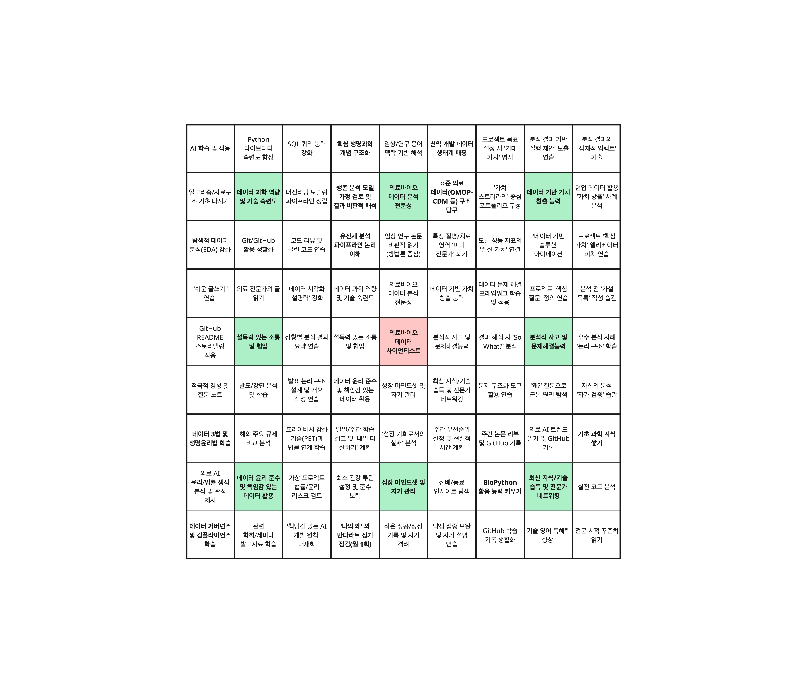

# Healthcare Data Scientist Growth Plan

저는 **의료/바이오 도메인 데이터 사이언티스트**를 목표로 나아가고자 합니다.
이 레포지토리는 저의 커리어 목표 달성을 위한 체계적인 계획과 성장 과정을 기록하는 공간이 될 것 같습니다.

## 목표: 왜 만다라트인가?

**최종 목표:** **의료 바이오 도메인 데이터 사이언티스트**

목표 달성을 위한 구체적이고 체계적인 로드맵을 수립하고자 많은 생각들을 했습니다. 마인드맵을 그리던 중, 오타니 쇼헤이 선수의 만다라트를 작성해보자는 생각이 들었습니다. 오타니 선수에게서 영감을 받아 **만다라트(Manda-la Chart)** 기법을 활용하기로 생각했습니다. 이 레포지토리는 저의 만다라트 계획과 그 실행 과정을 담고 있습니다.

## 동기: "내가 왜, 그리고 어떻게 이 길을 가려는가?"라는 질문에 대한 고민

제가 의료/바이오 데이터 사이언티스트라는 목표를 향해 나아가기로 결심한 이유는 아래와 같습니다.

*   **근본적 호기심:** 우주와 생명의 기원에서부터 이어지는 '생명체는 어떻게 작동하는가?'에 대한 깊은 궁금증.
*   **데이터의 힘:** 복잡한 생명 현상을 이해하고, '제대로 작동하지 않는 상태(질병)'의 패턴을 밝혀내는 강력한 도구로서 데이터 과학의 가능성에 대한 믿음.
*   **지적 성장 추구:** 의학, 생물학, 통계학, 컴퓨터 과학 등 다양한 학문이 융합되는 환경에서 끊임없이 배우고 지적으로 성장하고 싶은 열망.
*   **기여의 매력:** 생명의 '오작동'을 바로잡아 '아픈 것을 고쳐주는' 과정에 데이터 분석을 통해 실질적으로 기여하고 싶은 마음 (특히 생존 분석, 진단 모델 개선 등에 관심이 있습니다).
*   **'Fit'의 발견:** 끊임없이 새로운 기술이 나오고 배워야 할 것이 많다는 점을 오히려 지적 자극과 흥미로 느끼는 저의 성향과, 빠르게 변화하고 깊이 있는 탐구가 필요한 의료/바이오 분야의 특성이 잘 맞는다는 확신.

위 네 가지 동기들을 바탕으로, 저는 이 분야에서 즐겁게 몰입하면서도, 장기적으로 지속 및 성장할 수 있을 것이라 생각했습니다.

사실 이 목표를 설정하는 과정에서, 저는 두 가지 중요한 내적 고민과 마주해야 했습니다.
### 첫 번째 고민: "왜 다른 뛰어난 사람이 아닌, 바로 '나'인가?"
솔직히 이 질문에 대한 명쾌한 답을 찾는 것은 어려웠습니다. 세상에는 저보다 뛰어난 역량을 가진 분들이 많고, 그분들 역시 이 분야에서 훌륭한 기여를 할 수 있다는 것을 압니다. 하지만 오랜 고민 끝에, '나만이 할 수 있는 유일한 이유'를 찾는 대신, '나를 움직이게 하는 고유한 동기들의 조합' 과 '내가 이 분야와 얼마나 잘 맞는가(Fit)' 에 집중하기로 했습니다. 빅뱅에서 생명 현상으로 이어지는 거대한 질문에 대한 호기심, 데이터를 통해 '아픈 것을 고쳐주는' 과정에 기여하고 싶은 열망, 그리고 끊임없는 배움 자체를 즐기는 저의 성향은 온전히 제 것입니다. 또한, 비전공자이지만, 제가 살아온 길에서 얻은 남다른 시각은 문제 해결에 새로운 관점을 더할 수 있다고 믿습니다. 이것이 제가 이 길을 걸어가며 저만의 가치를 만들어갈 수 있는 이유라고 생각합니다.

### 두 번째 고민: "과연 내가 해낼 수 있을까? 아직 능력이 부족한데..."
새롭고 전문적인 분야에 도전하면서, 제 자신의 능력에 대한 불안감과 자신감 부족을 느끼는 것은 당연했습니다. 코드를 작성하거나 복잡한 분석을 수행하는 데 있어 아직 미숙하다는 것을 스스로 잘 알고 있습니다. 하지만 저는 "지금 당장은 못하더라도, 꾸준히 노력하면 나중엔 잘할 수 있다" 는 믿음을 가지고 있습니다. '오늘 부족했다면, 내일 더 잘하면 된다'는 생각으로 나아가고자 합니다. 바로 이 만다라트 계획 자체가 그 부족함을 메우기 위한 저의 구체적인 약속이자 노력의 청사진입니다. 이 계획을 통해 체계적으로 역량을 키우고, 작은 성공들을 쌓아가며 자신감을 얻고, 결국에는 목표에 도달할 수 있을 것이라 확신합니다.
결론적으로, 이 길은 저에게 가장 큰 지적 만족감, 성장, 그리고 의미를 줄 것이라는 믿음이 있습니다. 위에서 언급한 고민들을 안고 가면서도, 저를 이끄는 강력한 동기와 이 만다라트라는 구체적인 계획을 바탕으로 흔들림 없이 나아가고자 합니다.

## 나의 만다라트 로드맵

목표 달성을 위해 다음과 같이 8가지 핵심 역량을 정의하고, 각 역량별 8가지 구체적인 실천 계획을 수립했습니다.

### 8가지 핵심 역량

1.  **데이터 과학 역량 및 기술 숙련도:** 핵심 이론 이해 및 실무 도구 활용 능력 강화.
2.  **의료/바이오 데이터 분석 전문성:** 도메인 기본 지식 함양 및 관심 분야 심층 분석 능력 개발.
3.  **데이터 기반 가치 창출 능력:** 분석을 통해 실질적인 인사이트 도출 및 가치 제안 능력 배양.
4.  **설득력 있는 소통 및 다학제 협업:** 비전공자 대상 설명 능력 및 협업 역량 강화.
5.  **분석적 사고 및 문제 해결 능력:** 논리적/비판적 사고 및 데이터 기반 문제 해결 능력 함양.
6.  **데이터 윤리 준수 및 책임감 있는 데이터 활용:** 법규/윤리 이해 및 책임감 있는 데이터 활용 태도 내재화.
7.  **성장 마인드셋 및 자기 관리:** 어려움을 성장의 기회로 삼고, 꾸준히 목표를 향해 나아가는 태도 및 관리 능력.
8.  **최신 지식/기술 습득 및 전문가 네트워킹:** 최신 트렌드 학습 및 직간접적인 전문가 교류.

[만다라트 64가지 실천 계획 보기](mandalart/mandalart_details.md)

## 리포지토리 구조

*   **README.md:** 이 리포지토리의 개요 및 안내 (현재 파일).
*   **mandalart/**: 만다라트 차트 이미지 및 64가지 상세 실천 계획 목록.
*   **project_reviews/** (선택): 개인 프로젝트 진행 시 만다라트 계획 연계 기록 또는 회고.

## 현재 상태 및 다음 단계

현재 만다라트의 뼈대(핵심 목표 및 8가지 요소)와 64가지 구체적인 실천 계획 수립을 완료했습니다. 
이제 이 계획들을 바탕으로 꾸준히 실행하고 성장 과정을 기록해나갈 차례입니다.
매달 말을 기준으로 만다라트를 점검한 다음, 필요에 따라 계획을 수정하거나 추가할 예정입니다.

---
